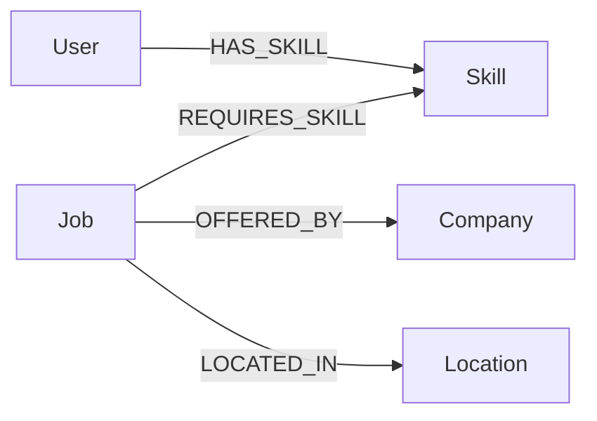

# Job Graph – Skill-Based Job Recommendation System

 1. Overview

Job Graph is a skill-based job recommendation web application powered by **CognoDB**, a graph database compatible with the Neo4j driver.
## Live Demo
http://localhost:8080


The application allows a candidate to:

1. Enter their name.
2. Enter their technical skills.
3. Submit their skills.
4. Find jobs that match those skills.
5. View the matching percentage for each job.
6. See company and location information.
7. Receive a clear empty state when no suitable jobs are found.

The goal is to demonstrate how a graph database can model relationships between candidates, skills, jobs, companies, and locations and use those relationships to produce relevant job recommendations.

---

## 2. Use Case

Traditional job matching can become difficult when the system needs to understand relationships between multiple entities.

For example, a candidate may have:

* Java
* Docker
* AWS

A job may require:

* Java
* Docker
* AWS
* SQL

Instead of simply performing a text search, the application traverses the graph relationships between skills and jobs to determine how many required skills match.

The application then calculates a match percentage:

**Match Percentage = Matching Skills / Total Required Skills × 100**

For example:

```text
Matching skills: 3
Required skills: 4

Match = 3 / 4 × 100 = 75%
```

---

## 3. Why a Graph Database?

A graph database is useful for this use case because the application is primarily concerned with relationships.

The important relationships include:

```text
User ──HAS_SKILL──> Skill

Job ──REQUIRES_SKILL──> Skill

Job ──OFFERED_BY──> Company

Job ──LOCATED_IN──> Location
```

A candidate's skills can therefore be connected directly to the skills required by jobs.

This makes relationship-based queries natural and allows the application to traverse from a candidate's skills to matching jobs and then to related companies and locations.

This is particularly useful when the application grows to support more complex relationships, such as:

* candidates sharing skills
* jobs requiring multiple skills
* companies offering multiple jobs
* jobs available across locations
* multi-hop skill and job relationships

---

## 4. Data Model

The main graph entities are:

| Node       | Important properties                            |
| ---------- | ----------------------------------------------- |
| `User`     | `id`, `name`                                    |
| `Skill`    | `id`, `name`, `category`                        |
| `Job`      | `id`, `title`, `description`, `experienceLevel` |
| `Company`  | `id`, `name`                                    |
| `Location` | `id`, `city`, `country`                         |

### Relationships

```text
(User)-[:HAS_SKILL]->(Skill)

(Job)-[:REQUIRES_SKILL]->(Skill)

(Job)-[:OFFERED_BY]->(Company)

(Job)-[:LOCATED_IN]->(Location)
```

### Graph model



---

## 5. Application Architecture

The application uses a simple layered architecture:

```text
Browser
   |
   | HTTP
   v
Spring Boot Controller
   |
   v
Recommendation Service
   |
   v
Job Graph Repository
   |
   | Neo4j Driver / Cypher
   v
CognoDB
```

### Main components

#### Frontend

The frontend is implemented using:

* HTML
* CSS
* JavaScript

The UI provides:

* Welcome screen
* Candidate details form
* Skill entry
* Skill removal
* Loading state
* Job recommendation results
* Empty state
* Error handling

#### Backend

The backend is implemented using:

* Java
* Spring Boot
* Maven
* Neo4j Java Driver

The backend exposes recommendation endpoints and communicates with CognoDB.

#### Database

CognoDB stores the graph consisting of users, skills, jobs, companies and locations.

---

## 6. Project Structure

```text
job-graph-app/
│
├── src/
│   └── main/
│       ├── java/
│       │   └── com/job_graph_app/
│       │       ├── controller/
│       │       ├── service/
│       │       ├── repository/
│       │       └── config/
│       │
│       └── resources/
│           └── static/
│               ├── index.html
│               ├── app.js
│               └── style.css
│
├── pom.xml
└── README.md
```

---

## 7. Recommendation Flow

The user interacts with the application through the browser.

### Step 1 – Candidate enters details

Example:

```text
Name: Neha

Skills:
Java
Docker
AWS
```

### Step 2 – Frontend sends the request

The frontend sends the candidate's skills to:

```text
POST /api/recommendations
```

Example request:

```json
{
  "name": "Neha",
  "skills": [
    "Java",
    "Docker",
    "AWS"
  ]
}
```

### Step 3 – Backend queries the graph

The repository searches for jobs that require the candidate's skills.

The query counts:

* matching skills
* total required skills

It then calculates the match percentage.

### Step 4 – Results are returned

Example:

```json
[
  {
    "job": "Full Stack Developer",
    "company": "Tech Solutions",
    "matchingSkills": 3,
    "matchPercentage": 100,
    "location": "Hyderabad",
    "totalRequiredSkills": 3
  },
  {
    "job": "Java Backend Developer",
    "company": "Tech Solutions",
    "matchingSkills": 3,
    "matchPercentage": 75,
    "location": "Bangalore",
    "totalRequiredSkills": 4
  }
]
```

### Step 5 – Frontend displays recommendations

The candidate sees the jobs ordered by match percentage.

---

## 8. Main Cypher Query

The recommendation query follows the graph relationship between jobs and required skills:

```cypher
MATCH (j:Job)-[:REQUIRES_SKILL]->(s:Skill)
WHERE any(skillName IN $skills
    WHERE toLower(s.name) = toLower(skillName))

WITH j, count(DISTINCT s) AS matchingSkills

MATCH (j)-[:REQUIRES_SKILL]->(requiredSkill:Skill)

WITH j,
     matchingSkills,
     count(DISTINCT requiredSkill) AS totalRequiredSkills

OPTIONAL MATCH (j)-[:OFFERED_BY]->(c:Company)
OPTIONAL MATCH (j)-[:LOCATED_IN]->(l:Location)

RETURN
    j.title AS job,
    c.name AS company,
    l.city AS location,
    matchingSkills,
    totalRequiredSkills,
    round(
        100.0 * matchingSkills / totalRequiredSkills
    ) AS matchPercentage

ORDER BY matchPercentage DESC
```

The query uses parameters rather than concatenating user input into Cypher.

This allows the application to safely pass the candidate's skill list to the database.

---

## 9. Other Graph Operations

The repository also supports creation and relationship operations for:

### Skills

```text
createSkill()
```

### Jobs

```text
createJob()
```

### Companies

```text
createCompany()
```

### Locations

```text
createLocation()
```

### Users

```text
createUser()
```

### Job-skill relationships

```text
addRequiredSkill()
```

### User-skill relationships

```text
addUserSkill()
```

### Job-company relationships

```text
addJobCompany()
```

### Job-location relationships

```text
addJobLocation()
```

These operations build the graph used by the recommendation system.

---

## 10. UI/UX

The application is designed for a non-technical candidate.

The main flow is:

```text
Welcome
   ↓
Enter name and skills
   ↓
Loading
   ↓
Job recommendations
```

The interface also handles situations where no jobs are found.

For example, entering a skill that does not match any current job produces:

```text
No matching jobs yet
```

Instead of displaying an empty or broken page.

The application also prevents duplicate skills from being added.

---

## 11. UI Screenshots

### Welcome Screen


### Job search page


### Candidate Details


### Job Recommendations


### Empty State


---

## 12. Prerequisites

Before running the application, install:

* Java 21 or compatible Java version used by the project
* Maven
* A CognoDB instance
* Git

Verify Java:

```bash
java -version
```

Verify Maven:

```bash
mvn -version
```

---

## 13. CognoDB Configuration

Database connection details are provided through environment variables.

They should **not be committed to GitHub**.

Configure the required CognoDB environment variables used by `DatabaseConfig`.

For PowerShell, example:

```powershell
$env:COGNODB_URI="your-cognodb-uri"
$env:COGNODB_USERNAME="your-username"
$env:COGNODB_PASSWORD="your-password"
```

Use the actual credentials provided by your CognoDB instance.

Do not place passwords or private connection details directly in source code.

---

## 14. Running the Application

Clone the repository:

```bash
git clone <YOUR_GITHUB_REPOSITORY_URL>
```

Enter the project directory:

```bash
cd job-graph-app
```

Build the application:

```bash
mvn clean package -DskipTests
```

Run the Spring Boot application:

```bash
mvn spring-boot:run
```

Once the application starts, open:

```text
http://localhost:8080
```

---

## 15. Testing the Application

### Test 1 – Matching skills

Enter:

```text
Name: Neha

Skills:
Java
Docker
AWS
```

Click:

```text
Find My Jobs
```

The application should display matching jobs and their match percentages.

### Test 2 – No matching jobs

Enter a skill that does not exist in the current job graph, such as:

```text
Python
```

The application should display:

```text
No matching jobs yet
```

### Test 3 – Duplicate skills

Try entering the same skill more than once.

The frontend prevents duplicate skills from being added.

---

## 16. Error Handling

The application handles several user-facing states:

### Loading

Displayed while the recommendation request is being processed.

### Empty state

Displayed when no jobs match the submitted skills.

### Validation

The application requires:

* a candidate name
* at least one skill

### Database/application error

If the recommendation service cannot be reached, the frontend displays an error message rather than silently failing.

---

## 17. Hosted Demo

**Demo URL:** `<ADD_HOSTED_APPLICATION_URL>`

The hosted application should remain available after submission so that the reviewers can test the application.

---

## 18. Screen Recording

A short screen recording demonstrates the complete user journey:

```text
Welcome page
    ↓
Enter candidate name
    ↓
Add skills
    ↓
Find My Jobs
    ↓
Loading state
    ↓
Job recommendations
    ↓
Change skills
    ↓
No matching jobs / empty state
```

**Recording URL:** `<ADD_SCREEN_RECORDING_URL>`

---

## 19. Future Improvements

Possible future improvements include:

* More sophisticated skill normalization
* Skill aliases and synonyms
* Filtering by location
* Filtering by experience level
* Job detail pages
* Candidate profiles
* Skill-gap recommendations
* More advanced multi-hop graph recommendations
* Authentication
* Pagination for larger job datasets

---

## 20. Submission

The final submission consists of:

* GitHub repository
* Complete source code
* CognoDB data/loading scripts
* Cypher queries
* README documentation
* Data model diagram
* UI screenshots
* Hosted application demo
* Short screen recording

---

## 21. Author

**Candidate:** Neha

**Project:** Job Graph – Skill-Based Job Recommendation System

**Technology:** Java, Spring Boot, JavaScript, CognoDB, Neo4j Driver
